# Index
1. [Microsoft Azure Fundamentals: Describe cloud concepts (25–30%)](#microsoft-azure-fundamentals-describe-cloud-concepts-2530)
2. [Azure Fundamentals: Describe Azure architecture and services (35–40%)](#azure-fundamentals-describe-azure-architecture-and-services-35–40)
3. [Azure Fundamentals: Describe Azure management and governance (30–35%)](#azure-fundamentals-describe-azure-management-and-governance-30–35)

&nbsp;

&nbsp;

# Microsoft Azure Fundamentals: Describe cloud concepts (25–30%)

## Shared responsibility model
With the shared responsibility model, these responsibilities get shared between the cloud provider and the consumer. If you’re using a cloud SQL database, the cloud provider would be responsible for maintaining the actual database. However, you’re still responsible for the data that gets ingested into the database.
The shared responsibility model is heavily tied into the cloud service types (covered later in this learning path): infrastructure as a service (IaaS), platform as a service (PaaS), and software as a service (SaaS). IaaS places the most responsibility on the consumer, with the cloud provider being responsible for the basics of physical security, power, and connectivity. On the other end of the spectrum, SaaS places most of the responsibility with the cloud provider. PaaS, being a middle ground between IaaS and SaaS, rests somewhere in the middle and evenly distributes responsibility between the cloud provider and the consumer.

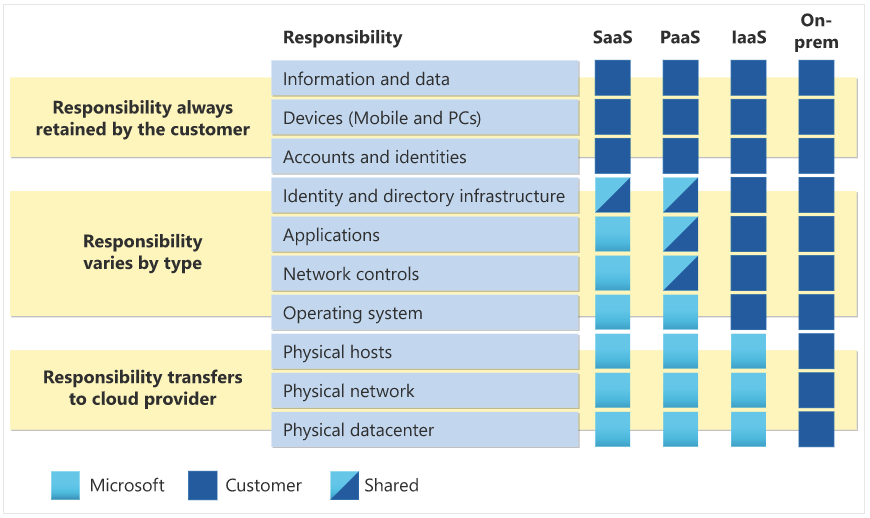
&nbsp;

## Cloud Models
A private cloud is, in some ways, the natural evolution from a corporate datacenter. It’s a cloud (delivering IT services over the internet) that’s built, controlled, and maintained by a single entity. Private cloud provides much greater control for the company and its IT department. 

### Public cloud
A public cloud is built, controlled, and maintained by a third-party cloud provider. With a public cloud, anyone that wants to purchase cloud services can access and use resources. The general public availability is a key difference between public and private clouds.

### Hybrid cloud
A hybrid cloud is a computing environment that uses both public and private clouds in an inter-connected environment. A hybrid cloud environment can be used to allow a private cloud to surge for increased, temporary demand by deploying public cloud resources. Hybrid cloud can be used to provide an extra layer of security. For example, users can flexibly choose which services to keep in public cloud and which to deploy to their private cloud infrastructure.

### Multi-cloud
A fourth, and increasingly likely scenario is a multi-cloud scenario. In a multi-cloud scenario, you use multiple public cloud providers. 

### Azure Arc
Azure Arc is a set of technologies that helps manage your cloud environment. Azure Arc can help manage your cloud environment, whether it's a public cloud solely on Azure, a private cloud in your datacenter, a hybrid configuration, or even a multi-cloud environment running on multiple cloud providers at once.

### Azure VMware Solution
What if you’re already established with VMware in a private cloud environment but want to migrate to a public or hybrid cloud? Azure VMware Solution lets you run your VMware workloads in Azure with seamless integration and scalability.

&nbsp;

## Consumption-based model
When comparing IT infrastructure models, there are two types of expenses to consider. Capital expenditure (CapEx) and operational expenditure (OpEx).

### CapEx 
Is typically a one-time, up-front expenditure to purchase or secure tangible resources. A new building, repaving the parking lot, building a datacenter, or buying a company vehicle are examples of CapEx.

### OpEx
In contrast, OpEx is spending money on services or products over time. Renting a convention center, leasing a company vehicle, or signing up for cloud services are all examples of OpEx. Cloud computing falls under OpEx because cloud computing operates on a consumption-based model.

&nbsp;

## Benifits of cloud computing

### High availability
When you’re deploying an application, a service, or any IT resources, it’s important the resources are available when needed. High availability focuses on ensuring maximum availability, regardless of disruptions or events that may occur.
When you’re architecting your solution, you’ll need to account for service availability guarantees. Azure is a highly available cloud environment with uptime guarantees depending on the service.

### Scalability
Scalability refers to the ability to adjust resources to meet demand. If you suddenly experience peak traffic and your systems are overwhelmed, the ability to scale means you can add more resources to better handle the increased demand.
The other benefit of scalability is that you aren't overpaying for services. 
Scaling generally comes in two varieties: vertical and horizontal. Vertical scaling is focused on increasing or decreasing the capabilities of resources. Horizontal scaling is adding or subtracting the number of resources.

#### Vertical scaling
With vertical scaling, if you were developing an app and you needed more processing power, you could vertically scale up to add more CPUs or RAM to the virtual machine. Conversely, if you realized you had over-specified the needs, you could vertically scale down by lowering the CPU or RAM specifications.

#### Horizontal scaling
With horizontal scaling, if you suddenly experienced a steep jump in demand, your deployed resources could be scaled out (either automatically or manually). For example, you could add additional virtual machines or containers, scaling out. In the same manner, if there was a significant drop in demand, deployed resources could be scaled in (either automatically or manually), scaling in.

### Reliability
Reliability is the ability of a system to recover from failures and continue to function. It's also one of the pillars of the Microsoft Azure Well-Architected Framework.
The cloud, by virtue of its decentralized design, naturally supports a reliable and resilient infrastructure. With a decentralized design, the cloud enables you to have resources deployed in regions around the world. With this global scale, even if one region has a catastrophic event other regions are still up and running. 

### Predictability
Predictability in the cloud lets you move forward with confidence. Predictability can be focused on performance predictability or cost predictability. Both performance and cost predictability are heavily influenced by the Microsoft Azure Well-Architected Framework. Deploy a solution that’s built around this framework and you have a solution that’s cost and performance are predictable.

### Performance
Performance predictability focuses on predicting the resources needed to deliver a positive experience for your customers. Autoscaling, load balancing, and high availability are just some of the cloud concepts that support performance predictability. If you suddenly need more resources, autoscaling can deploy additional resources to meet the demand, and then scale back when the demand drops. Or if the traffic is heavily focused on one area, load balancing will help redirect some of the overload to less stressed areas.

### Cost
Cost predictability is focused on predicting or forecasting the cost of the cloud spend. With the cloud, you can track your resource use in real time, monitor resources to ensure that you’re using them in the most efficient way, and apply data analytics to find patterns and trends that help better plan resource deployments. By operating in the cloud and using cloud analytics and information, you can predict future costs and adjust your resources as needed. You can even use tools like the Total Cost of Ownership (TCO) or Pricing Calculator to get an estimate of potential cloud spend.

&nbsp;

## Security and governance in the cloud

### Management of the cloud
Management of the cloud speaks to managing your cloud resources. In the cloud, you can:
- Automatically scale resource deployment based on need.
- Deploy resources based on a preconfigured template, removing the need for manual configuration.
- Monitor the health of resources and automatically replace failing resources.
- Receive automatic alerts based on configured metrics, so you’re aware of performance in real time.

### Management in the cloud
Management in the cloud speaks to how you’re able to manage your cloud environment and resources. You can manage these:
- Through a web portal.
- Using a command line interface.
- Using APIs.
- Using PowerShell.

&nbsp;

## Cloud Service types

### Infrastructure as a service (IaaS) 
This is the most flexible category of cloud services, as it provides you the maximum amount of control for your cloud resources. In an IaaS model, the cloud provider is responsible for maintaining the hardware, network connectivity (to the internet), and physical security. You’re responsible for everything else: operating system installation, configuration, and maintenance; network configuration; database and storage configuration; and so on. With IaaS, you’re essentially renting the hardware in a cloud datacenter, but what you do with that hardware is up to you.
Infrastructure as a service (IaaS) is the most flexible category of cloud services, as it provides you the maximum amount of control for your cloud resources. In an IaaS model, the cloud provider is responsible for maintaining the hardware, network connectivity (to the internet), and physical security. You’re responsible for everything else: operating system installation, configuration, and maintenance; network configuration; database and storage configuration; and so on. With IaaS, you’re essentially renting the hardware in a cloud datacenter, but what you do with that hardware is up to you.

> #### Scenarios
Some common scenarios where IaaS might make sense include:

- Lift-and-shift migration: You’re standing up cloud resources similar to your on-prem datacenter, and then simply moving the things running on-prem to running on the IaaS infrastructure.
- Testing and development: You have established configurations for development and test environments that you need to rapidly replicate. You can stand up or shut down the different environments rapidly with an IaaS structure, while maintaining complete control.

### Platform as a service (PaaS) 
It is a middle ground between renting space in a datacenter (infrastructure as a service) and paying for a complete and deployed solution (software as a service). In a PaaS environment, the cloud provider maintains the physical infrastructure, physical security, and connection to the internet. They also maintain the operating systems, middleware, development tools, and business intelligence services that make up a cloud solution. In a PaaS scenario, you don't have to worry about the licensing or patching for operating systems and databases.
PaaS is well suited to provide a complete development environment without the headache of maintaining all the development infrastructure.

> #### Scenarios
Some common scenarios where PaaS might make sense include:

- Development framework: PaaS provides a framework that developers can build upon to develop or customize cloud-based applications. Similar to the way you create an Excel macro, PaaS lets developers create applications using built-in software components. Cloud features such as scalability, high-availability, and multi-tenant capability are included, reducing the amount of coding that developers must do.
- Analytics or business intelligence: Tools provided as a service with PaaS allow organizations to analyze and mine their data, finding insights and patterns and predicting outcomes to improve forecasting, product design decisions, investment returns, and other business decisions.

### Software as a service (SaaS) 
It is the most complete cloud service model from a product perspective. With SaaS, you’re essentially renting or using a fully developed application. Email, financial software, messaging applications, and connectivity software are all common examples of a SaaS implementation.
While the SaaS model may be the least flexible, it’s also the easiest to get up and running. It requires the least amount of technical knowledge or expertise to fully employ.

> #### Scenarios
Some common scenarios for SaaS are:

- Email and messaging.
- Business productivity applications.
- Finance and expense tracking.
  
[Back to top ⬆️](#index)

# Azure Fundamentals: Describe Azure architecture and services (35–40%)

## Azure accounts

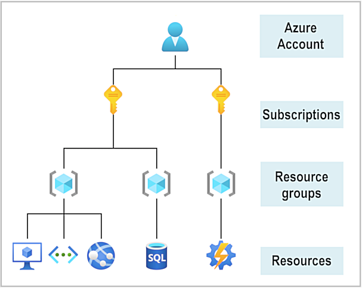

### The Azure free account includes:

- Free access to popular Azure products for 12 months.
- A credit to use for the first 30 days.
- Access to more than 25 products that are always free.

### The Azure free student account offer includes:

- Free access to certain Azure services for 12 months.
- A credit to use in the first 12 months.
- Free access to certain software developer tools.

The Azure free student account is an offer for students that gives $100 credit and free developer tools. Also, you can sign up without a credit card.

## Physical infrastructure

The physical infrastructure for Azure starts with datacenters. Conceptually, the datacenters are the same as large corporate datacenters. They’re facilities with resources arranged in racks, with dedicated power, cooling, and networking infrastructure.

As a global cloud provider, Azure has datacenters around the world. However, these individual datacenters aren’t directly accessible. Datacenters are grouped into Azure Regions or Azure Availability Zones that are designed to help you achieve resiliency and reliability for your business-critical workloads.

## Regions

A region is a geographical area on the planet that contains at least one, but potentially multiple datacenters that are nearby and networked together with a low-latency network. Azure intelligently assigns and controls the resources within each region to ensure workloads are appropriately balanced.

## Availability Zones

Availability zones are physically separate datacenters within an Azure region. Each availability zone is made up of one or more datacenters equipped with independent power, cooling, and networking. An availability zone is set up to be an isolation boundary. If one zone goes down, the other continues working. Availability zones are connected through high-speed, private fiber-optic networks.

You want to ensure your services and data are redundant so you can protect your information in case of failure. When you host your infrastructure, setting up your own redundancy requires that you create duplicate hardware environments. Azure can help make your app highly available through availability zones.

Availability zones are primarily for VMs, managed disks, load balancers, and SQL databases. Azure services that support availability zones fall into three categories:

- Zonal services: You pin the resource to a specific zone (for example, VMs, managed disks, IP addresses).
- Zone-redundant services: The platform replicates automatically across zones (for example, zone-redundant storage, SQL Database).
- Non-regional services: Services are always available from Azure geographies and are resilient to zone-wide outages as well as region-wide outages.

### Region pairs

Most Azure regions are paired with another region within the same geography (such as US, Europe, or Asia) at least 300 miles away. This approach allows for the replication of resources across a geography that helps reduce the likelihood of interruptions because of events such as natural disasters, civil unrest, power outages, or physical network outages that affect an entire region. For example, if a region in a pair was affected by a natural disaster, services would automatically fail over to the other region in its region pair.

### Sovereign Regions

In addition to regular regions, Azure also has sovereign regions. Sovereign regions are instances of Azure that are isolated from the main instance of Azure. You may need to use a sovereign region for compliance or legal purposes.

## Azure resources

A resource is the basic building block of Azure. Anything you create, provision, deploy, etc. is a resource. Virtual Machines (VMs), virtual networks, databases, cognitive services, etc. are all considered resources within Azure.

## Azure resource groups

Resource groups are simply groupings of resources. When you create a resource, you’re required to place it into a resource group. While a resource group can contain many resources, a single resource can only be in one resource group at a time. Some resources may be moved between resource groups, but when you move a resource to a new group, it will no longer be associated with the former group. Additionally, resource groups can't be nested, meaning you can’t put resource group B inside of resource group A.

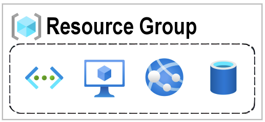

## Azure subscriptions

In Azure, subscriptions are a unit of management, billing, and scale. Similar to how resource groups are a way to logically organize resources, subscriptions allow you to logically organize your resource groups and facilitate billing.

A subscription provides you with authenticated and authorized access to Azure products and services. It also allows you to provision resources. An Azure subscription links to an Azure account, which is an identity in Azure Active Directory (Azure AD) or in a directory that Azure AD trusts.

An account can have multiple subscriptions, but it’s only required to have one. In a multi-subscription account, you can use the subscriptions to configure different billing models and apply different access-management policies. 

You can use Azure subscriptions to define boundaries around Azure products, services, and resources. There are two types of subscription boundaries that you can use:

- Billing boundary: This subscription type determines how an Azure account is billed for using Azure. You can create multiple subscriptions for different types of billing requirements. Azure generates separate billing reports and invoices for each subscription so that you can organize and manage costs.
- Access control boundary: Azure applies access-management policies at the subscription level, and you can create separate subscriptions to reflect different organizational structures. An example is that within a business, you have different departments to which you apply distinct Azure subscription policies. This billing model allows you to manage and control access to the resources that users provision with specific subscriptions.

## Azure management groups

The final piece is the management group. Resources are gathered into resource groups, and resource groups are gathered into subscriptions.

If you have many subscriptions, you might need a way to efficiently manage access, policies, and compliance for those subscriptions. Azure management groups provide a level of scope above subscriptions. You organize subscriptions into containers called management groups and apply governance conditions to the management groups. All subscriptions within a management group automatically inherit the conditions applied to the management group, the same way that resource groups inherit settings from subscriptions and resources inherit from resource groups. Management groups give you enterprise-grade management at a large scale, no matter what type of subscriptions you might have. Management groups can be nested.

Some examples of how you could use management groups might be:
- Create a hierarchy that applies a policy.
- Provide user access to multiple subscriptions.

## Azure Virtual Machines

With Azure Virtual Machines (VMs), you can create and use VMs in the cloud. VMs provide infrastructure as a service (IaaS) in the form of a virtualized server and can be used in many ways. Just like a physical computer, you can customize all of the software running on your VM.

An Azure VM gives you the flexibility of virtualization without having to buy and maintain the physical hardware that runs the VM. However, as an IaaS offering, you still need to configure, update, and maintain the software that runs on the VM.

## Virtual machine scale sets

Virtual machine scale sets let you create and manage a group of identical, load-balanced VMs. If you simply created multiple VMs with the same purpose, you’d need to ensure they were all configured identically and then set up network routing parameters to ensure efficiency. You’d also have to monitor the utilization to determine if you need to increase or decrease the number of VMs.

Instead, with virtual machine scale sets, Azure automates most of that work. Scale sets allow you to centrally manage, configure, and update a large number of VMs in minutes. The number of VM instances can automatically increase or decrease in response to demand, or you can set it to scale based on a defined schedule. Virtual machine scale sets also automatically deploy a load balancer to make sure that your resources are being used efficiently. With virtual machine scale sets, you can build large-scale services for areas such as compute, big data, and container workloads.

## Virtual machine availability sets

Virtual machine availability sets are another tool to help you build a more resilient, highly available environment. Availability sets are designed to ensure that VMs stagger updates and have varied power and network connectivity, preventing you from losing all your VMs with a single network or power failure.

Availability sets do this by grouping VMs in two ways: update domain and fault domain.

- Update domain: The update domain groups VMs that can be rebooted at the same time.
- Fault domain: The fault domain groups your VMs by common power source and network switch. 

## VM Resources

When you provision a VM, you’ll also have the chance to pick the resources that are associated with that VM, including:

- Size (purpose, number of processor cores, and amount of RAM)
- Storage disks (hard disk drives, solid state drives, etc.)
- Networking (virtual network, public IP address, and port configuration)

## Azure Virtual Desktop

Another type of virtual machine is the Azure Virtual Desktop. Azure Virtual Desktop is a desktop and application virtualization service that runs on the cloud. It enables you to use a cloud-hosted version of Windows from any location. Azure Virtual Desktop works across devices and operating systems, and works with apps that you can use to access remote desktops or most modern browsers.

## Azure Containersç

Containers are a virtualization environment. Much like running multiple virtual machines on a single physical host, you can run multiple containers on a single physical or virtual host. Unlike virtual machines, you don't manage the operating system for a container. Virtual machines appear to be an instance of an operating system that you can connect to and manage. 

Containers are lightweight and designed to be created, scaled out, and stopped dynamically. It's possible to create and deploy virtual machines as application demand increases, but containers are a lighter weight, more agile method. Containers are designed to allow you to respond to changes on demand. With containers, you can quickly restart if there's a crash or hardware interruption. One of the most popular container engines is Docker, which is supported by Azure.

## Azure Container Instances

Azure Container Instances offer the fastest and simplest way to run a container in Azure; without having to manage any virtual machines or adopt any additional services. Azure Container Instances are a platform as a service (PaaS) offering. Azure Container Instances allow you to upload your containers and then the service will run the containers for you.

Containers are often used to create solutions by using a microservice architecture. This architecture is where you break solutions into smaller, independent pieces. For example, you might split a website into a container hosting your front end, another hosting your back end, and a third for storage. This split allows you to separate portions of your app into logical sections that can be maintained, scaled, or updated independently.

## Azure Functions

Azure Functions is an event-driven, serverless compute option that doesn’t require maintaining virtual machines or containers. If you build an app using VMs or containers, those resources have to be “running” in order for your app to function. With Azure Functions, an event wakes the function, alleviating the need to keep resources provisioned when there are no events.

Using Azure Functions is ideal when you're only concerned about the code running your service and not about the underlying platform or infrastructure. Functions are commonly used when you need to perform work in response to an event (often via a REST request), timer, or message from another Azure service, and when that work can be completed quickly, within seconds or less.

- Functions scale automatically based on demand, so they may be a good choice when demand is variable.
- Functions can be either stateless or stateful.
- Functions are a key component of serverless computing.

## Application hosting options

### Azure App Service

App Service enables you to build and host web apps, background jobs, mobile back-ends, and RESTful APIs in the programming language of your choice without managing infrastructure. It offers automatic scaling and high availability. App Service supports Windows and Linux. It enables automated deployments from GitHub, Azure DevOps, or any Git repo to support a continuous deployment model.

Azure App Service is an HTTP-based service for hosting web applications, REST APIs, and mobile back ends.

### Types of app services

With App Service, you can host most common app service styles like:

- Web apps
- API apps
- WebJobs
- Mobile apps

App Service handles most of the infrastructure decisions you deal with in hosting web-accessible apps

With App Service, you can host most common app service styles like:

- Web apps
- API apps
- WebJobs
- Mobile apps

App Service handles most of the infrastructure decisions you deal with in hosting web-accessible apps

## Azure Virtual Networking

Azure virtual networks and virtual subnets enable Azure resources, such as VMs, web apps, and databases, to communicate with each other, with users on the internet, and with your on-premises client computers. You can think of an Azure network as an extension of your on-premises network with resources that link other Azure resources.

Azure virtual networks provide the following key networking capabilities:

- Isolation and segmentation
- Internet communications
- Communicate between Azure resources
- Communicate with on-premises resources
- Route network traffic
- Filter network traffic
- Connect virtual networks

Azure virtual networking supports both public and private endpoints to enable communication between external or internal resources with other internal resources.

- Public endpoints have a public IP address and can be accessed from anywhere in the world.
- Private endpoints exist within a virtual network and have a private IP address from within the address space of that virtual network.

## Azure Virtual Private Networks

A virtual private network (VPN) uses an encrypted tunnel within another network. VPNs are typically deployed to connect two or more trusted private networks to one another over an untrusted network (typically the public internet). Traffic is encrypted while traveling over the untrusted network to prevent eavesdropping or other attacks. VPNs can enable networks to safely and securely share sensitive information.

## VPN gateways

A VPN gateway is a type of virtual network gateway. Azure VPN Gateway instances are deployed in a dedicated subnet of the virtual network and enable the following connectivity:

- Connect on-premises datacenters to virtual networks through a site-to-site connection.
- Connect individual devices to virtual networks through a point-to-site connection.
- Connect virtual networks to other virtual networks through a network-to-network connection.

All data transfer is encrypted inside a private tunnel as it crosses the internet. You can deploy only one VPN gateway in each virtual network. However, you can use one gateway to connect to multiple locations, which includes other virtual networks or on-premises datacenters.

When you deploy a VPN gateway, you specify the VPN type: either policy-based or route-based:

- Policy-based VPN gateways specify statically the IP address of packets that should be encrypted through each tunnel.
- In Route-based gateways, IPSec tunnels are modeled as a network interface or virtual tunnel interface. 

Use a route-based VPN gateway if you need any of the following types of connectivity:

- Connections between virtual networks
- Point-to-site connections
- Multisite connections
- Coexistence with an Azure ExpressRoute gateway

## High-availability scenarios

If you’re configuring a VPN to keep your information safe, you also want to be sure that it’s a highly available and fault tolerant VPN configuration. There are a few ways to maximize the resiliency of your VPN gateway.

### Active/standby
By default, VPN gateways are deployed as two instances in an active/standby configuration, even if you only see one VPN gateway resource in Azure. When planned maintenance or unplanned disruption affects the active instance, the standby instance automatically assumes responsibility for connections without any user intervention. Connections are interrupted during this failover, but they're typically restored within a few seconds for planned maintenance and within 90 seconds for unplanned disruptions.

### Active/active
With the introduction of support for the BGP routing protocol, you can also deploy VPN gateways in an active/active configuration. In this configuration, you assign a unique public IP address to each instance. You then create separate tunnels from the on-premises device to each IP address. You can extend the high availability by deploying an additional VPN device on-premises.

### ExpressRoute failover
Another high-availability option is to configure a VPN gateway as a secure failover path for ExpressRoute connections. ExpressRoute circuits have resiliency built in. However, they aren't immune to physical problems that affect the cables delivering connectivity or outages that affect the complete ExpressRoute location. In high-availability scenarios, where there's risk associated with an outage of an ExpressRoute circuit, you can also provision a VPN gateway that uses the internet as an alternative method of connectivity. In this way, you can ensure there's always a connection to the virtual networks.

### Zone-redundant gateways
In regions that support availability zones, VPN gateways and ExpressRoute gateways can be deployed in a zone-redundant configuration. This configuration brings resiliency, scalability, and higher availability to virtual network gateways. Deploying gateways in Azure availability zones physically and logically separates gateways within a region while protecting your on-premises network connectivity to Azure from zone-level failures. These gateways require different gateway SKUs and use Standard public IP addresses instead of Basic public IP addresses.

## Azure ExpressRoute

Azure ExpressRoute lets you extend your on-premises networks into the Microsoft cloud over a private connection, with the help of a connectivity provider. This connection is called an ExpressRoute Circuit. With ExpressRoute, you can establish connections to Microsoft cloud services, such as Microsoft Azure and Microsoft 365. This allows you to connect offices, datacenters, or other facilities to the Microsoft cloud. Each location would have its own ExpressRoute circuit.

Connectivity can be from an any-to-any (IP VPN) network, a point-to-point Ethernet network, or a virtual cross-connection through a connectivity provider at a colocation facility. ExpressRoute connections don't go over the public Internet. This allows ExpressRoute connections to offer more reliability, faster speeds, consistent latencies, and higher security than typical connections over the Internet.

### Features and benefits of ExpressRoute

There are several benefits to using ExpressRoute as the connection service between Azure and on-premises networks.

- Connectivity to Microsoft cloud services across all regions in the geopolitical region.
- Global connectivity to Microsoft services across all regions with the ExpressRoute Global Reach.
- Dynamic routing between your network and Microsoft via Border Gateway Protocol (BGP).
- Built-in redundancy in every peering location for higher reliability.

### ExpressRoute connectivity models

ExpressRoute supports four models that you can use to connect your on-premises network to the Microsoft cloud:

- CloudExchange colocation
- Point-to-point Ethernet connection
- Any-to-any connection
- Directly from ExpressRoute sites

### Security considerations

With ExpressRoute, your data doesn't travel over the public internet, so it's not exposed to the potential risks associated with internet communications. ExpressRoute is a private connection from your on-premises infrastructure to your Azure infrastructure. Even if you have an ExpressRoute connection, DNS queries, certificate revocation list checking, and Azure Content Delivery Network requests are still sent over the public internet.

## Azure DNS

Azure DNS is a hosting service for DNS domains that provides name resolution by using Microsoft Azure infrastructure. By hosting your domains in Azure, you can manage your DNS records using the same credentials, APIs, tools, and billing as your other Azure services.

### Benefits of Azure DNS
Azure DNS leverages the scope and scale of Microsoft Azure to provide numerous benefits, including:

- Reliability and performance
- Security
- Ease of Use - Azure DNS can manage DNS records for your Azure services and provide DNS for your external resources as well.
- Customizable virtual networks - Azure DNS also supports private DNS domains. 
- Alias records

## Azure storage accounts

A storage account provides a unique namespace for your Azure Storage data that's accessible from anywhere in the world over HTTP or HTTPS. Data in this account is secure, highly available, durable, and massively scalable.

When you create your storage account, you’ll start by picking the storage account type. The type of account determines the storage services and redundancy options and has an impact on the use cases. Below is a list of redundancy options that will be covered later in this module:

- Locally redundant storage (LRS)
- Geo-redundant storage (GRS)
- Read-access geo-redundant storage (RA-GRS)
- Zone-redundant storage (ZRS)
- Geo-zone-redundant storage (GZRS)
- Read-access geo-zone-redundant storage (RA-GZRS)

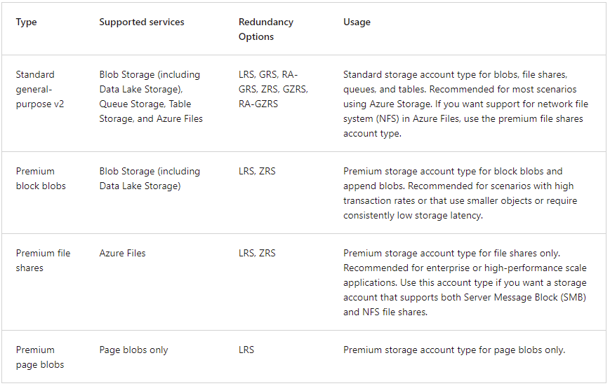

### Storage account endpoints

One of the benefits of using an Azure Storage Account is having a unique namespace in Azure for your data. In order to do this, every storage account in Azure must have a unique-in-Azure account name. The combination of the account name and the Azure Storage service endpoint forms the endpoints for your storage account.

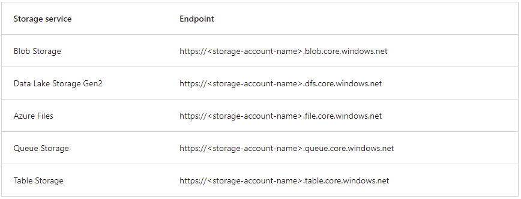

## Azure storage redundancy

Azure Storage always stores multiple copies of your data so that it's protected from planned and unplanned events such as transient hardware failures, network or power outages, and natural disasters. Redundancy ensures that your storage account meets its availability and durability targets even in the face of failures.

### Redundancy in the primary region
Data in an Azure Storage account is always replicated three times in the primary region. Azure Storage offers two options for how your data is replicated in the primary region, locally redundant storage (LRS) and zone-redundant storage (ZRS).

### Locally redundant storage

Locally redundant storage (LRS) replicates your data three times within a single data center in the primary region. LRS provides at least 11 nines of durability (99.999999999%) of objects over a given year.

LRS is the lowest-cost redundancy option and offers the least durability compared to other options. LRS protects your data against server rack and drive failures. However, if a disaster such as fire or flooding occurs within the data center, all replicas of a storage account using LRS may be lost or unrecoverable. To mitigate this risk, Microsoft recommends using zone-redundant storage (ZRS), geo-redundant storage (GRS), or geo-zone-redundant storage (GZRS).

### Zone-redundant storage

For Availability Zone-enabled Regions, zone-redundant storage (ZRS) replicates your Azure Storage data synchronously across three Azure availability zones in the primary region. ZRS offers durability for Azure Storage data objects of at least 12 nines (99.9999999999%) over a given year.

With ZRS, your data is still accessible for both read and write operations even if a zone becomes unavailable. No remounting of Azure file shares from the connected clients is required. If a zone becomes unavailable, Azure undertakes networking updates, such as DNS repointing. These updates may affect your application if you access data before the updates have completed.

### Redundancy in a secondary region

For applications requiring high durability, you can choose to additionally copy the data in your storage account to a secondary region that is hundreds of miles away from the primary region. If your storage account is copied to a secondary region, then your data is durable even if complete regional outage or a disaster in which the primary region isn't recoverable.

When you create a storage account, you select the primary region for the account. The paired secondary region is based on Azure Region Pairs, and can't be changed.

By default, data in the secondary region isn't available for read or write access unless there's a failover to the secondary region. If the primary region becomes unavailable, you can choose to fail over to the secondary region. After the failover has completed, the secondary region becomes the primary region, and you can again read and write data.

### Geo-redundant storage

GRS copies your data synchronously three times within a single physical location in the primary region using LRS. It then copies your data asynchronously to a single physical location in the secondary region (the region pair) using LRS. GRS offers durability for Azure Storage data objects of at least 16 nines (99.99999999999999%) over a given year.

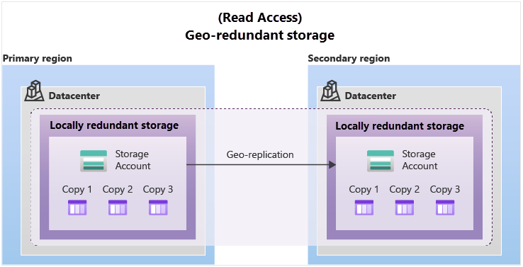

### Geo-zone-redundant storage

GZRS combines the high availability provided by redundancy across availability zones with protection from regional outages provided by geo-replication. Data in a GZRS storage account is copied across three Azure availability zones in the primary region (similar to ZRS) and is also replicated to a secondary geographic region, using LRS, for protection from regional disasters. Microsoft recommends using GZRS for applications requiring maximum consistency, durability, and availability, excellent performance, and resilience for disaster recovery.

Read access to data in the secondary region
Geo-redundant storage (with GRS or GZRS) replicates your data to another physical location in the secondary region to protect against regional outages. However, that data is available to be read only if the customer or Microsoft initiates a failover from the primary to secondary region. However, if you enable read access to the secondary region, your data is always available, even when the primary region is running optimally. For read access to the secondary region, enable read-access geo-redundant storage (RA-GRS) or read-access geo-zone-redundant storage (RA-GZRS).

## Azure storage services

The Azure Storage platform includes the following data services:

- Azure Blobs: A massively scalable object store for text and binary data. Also includes support for big data analytics through Data Lake Storage Gen2.
- Azure Files: Managed file shares for cloud or on-premises deployments.
- Azure Queues: A messaging store for reliable messaging between application components.
Azure Disks: Block-level storage volumes for Azure VMs.

### Blob storage

Azure Blob Storage is an object storage solution for the cloud. It can store massive amounts of data, such as text or binary data. Azure Blob Storage is unstructured, meaning that there are no restrictions on the kinds of data it can hold. Blob Storage can manage thousands of simultaneous uploads, massive amounts of video data, constantly growing log files, and can be reached from anywhere with an internet connection.

Blobs aren't limited to common file formats. A blob could contain gigabytes of binary data streamed from a scientific instrument, an encrypted message for another application, or data in a custom format for an app you're developing. One advantage of blob storage over disk storage is that it doesn't require developers to think about or manage disks. Data is uploaded as blobs, and Azure takes care of the physical storage needs.

#### Blob storage is ideal for:

- Serving images or documents directly to a browser.
- Storing files for distributed access.
- Streaming video and audio.
- Storing data for backup and restore, disaster recovery, and archiving.
- Storing data for analysis by an on-premises or Azure-hosted service.

### Accessing blob storage

Objects in Blob storage can be accessed from anywhere in the world via HTTP or HTTPS. Users or client applications can access blobs via URLs, the Azure Storage REST API, Azure PowerShell, Azure CLI, or an Azure Storage client library. The storage client libraries are available for multiple languages, including .NET, Java, Node.js, Python, PHP, and Ruby.

### Blob storage tiers
Data stored in the cloud can grow at an exponential pace. To manage costs for your expanding storage needs, it's helpful to organize your data based on attributes like frequency of access and planned retention period. Data stored in the cloud can be handled differently based on how it's generated, processed, and accessed over its lifetime. Some data is actively accessed and modified throughout its lifetime. Some data is accessed frequently early in its lifetime, with access dropping drastically as the data ages. Some data remains idle in the cloud and is rarely, if ever, accessed after it's stored. To accommodate these different access needs, Azure provides several access tiers, which you can use to balance your storage costs with your access needs.

Azure Storage offers different access tiers for your blob storage, helping you store object data in the most cost-effective manner. The available access tiers include:

- Hot access tier: Optimized for storing data that is accessed frequently (for example, images for your website).
- Cool access tier: Optimized for data that is infrequently accessed and stored for at least 30 days (for example, invoices for your customers).
- Archive access tier: Appropriate for data that is rarely accessed and stored for at least 180 days, with flexible latency requirements (for example, long-term backups).

### Azure Files

Azure Files offers fully managed file shares in the cloud that are accessible via the industry standard Server Message Block (SMB) or Network File System (NFS) protocols. Azure Files file shares can be mounted concurrently by cloud or on-premises deployments. SMB Azure file shares are accessible from Windows, Linux, and macOS clients. NFS Azure Files shares are accessible from Linux or macOS clients. Additionally, SMB Azure file shares can be cached on Windows Servers with Azure File Sync for fast access near where the data is being used.

Azure Files key benefits:
- Shared access
- Fully managed
- Scripting and tooling
- Resiliency
- Familiar programmability

### Queue storage

Azure Queue Storage is a service for storing large numbers of messages. Once stored, you can access the messages from anywhere in the world via authenticated calls using HTTP or HTTPS. A queue can contain as many messages as your storage account has room for (potentially millions). Each individual message can be up to 64 KB in size. Queues are commonly used to create a backlog of work to process asynchronously.

### Disk storage

Disk storage, or Azure managed disks, are block-level storage volumes managed by Azure for use with Azure VMs. Conceptually, they’re the same as a physical disk, but they’re virtualized – offering greater resiliency and availability than a physical disk. With managed disks, all you have to do is provision the disk, and Azure will take care of the rest.

## Azure data migration options

### Azure Migrate

Azure Migrate is a service that helps you migrate from an on-premises environment to the cloud. Azure Migrate functions as a hub to help you manage the assessment and migration of your on-premises datacenter to Azure. It provides the following:

- Unified migration platform: A single portal to start, run, and track your migration to Azure.
- Range of tools: A range of tools for assessment and migration. Azure Migrate tools include Azure Migrate: Discovery and assessment and Azure Migrate: Server Migration. Azure Migrate also integrates with other Azure services and tools, and with independent software vendor (ISV) offerings.
- Assessment and migration: In the Azure Migrate hub, you can assess and migrate your on-premises infrastructure to Azure.

### Azure Data Box

Azure Data Box is a physical migration service that helps transfer large amounts of data in a quick, inexpensive, and reliable way. The secure data transfer is accelerated by shipping you a proprietary Data Box storage device that has a maximum usable storage capacity of 80 terabytes. The Data Box is transported to and from your datacenter via a regional carrier. A rugged case protects and secures the Data Box from damage during transit.

You can order the Data Box device via the Azure portal to import or export data from Azure. Once the device is received, you can quickly set it up using the local web UI and connect it to your network. Once you’re finished transferring the data (either into or out of Azure), simply return the Data Box. If you’re transferring data into Azure, the data is automatically uploaded once Microsoft receives the Data Box back. The entire process is tracked end-to-end by the Data Box service in the Azure portal.

> Use cases

Data Box is ideally suited to transfer data sizes larger than 40 TBs in scenarios with no to limited network connectivity. The data movement can be one-time, periodic, or an initial bulk data transfer followed by periodic transfers.

Here are the various scenarios where Data Box can be used to import data to Azure.

- Onetime migration - when a large amount of on-premises data is moved to Azure.
- Moving a media library from offline tapes into Azure to - create an online media library.
- Migrating your VM farm, SQL server, and applications to Azure.
- Moving historical data to Azure for in-depth analysis and reporting using HDInsight.
- Initial bulk transfer - when an initial bulk transfer is done using Data Box (seed) followed by incremental transfers over the network.
- Periodic uploads - when large amount of data is generated periodically and needs to be moved to Azure.

## Azure file movement options

In addition to large scale migration using services like Azure Migrate and Azure Data Box, Azure also has tools designed to help you move or interact with individual files or small file groups. Among those tools are AzCopy, Azure Storage Explorer, and Azure File Sync.

### AzCopy

AzCopy is a command-line utility that you can use to copy blobs or files to or from your storage account. With AzCopy, you can upload files, download files, copy files between storage accounts, and even synchronize files. AzCopy can even be configured to work with other cloud providers to help move files back and forth between clouds.

### Azure Storage Explorer

Azure Storage Explorer is a standalone app that provides a graphical interface to manage files and blobs in your Azure Storage Account. It works on Windows, macOS, and Linux operating systems and uses AzCopy on the backend to perform all of the file and blob management tasks. With Storage Explorer, you can upload to Azure, download from Azure, or move between storage accounts.

### Azure File Sync

Azure File Sync is a tool that lets you centralize your file shares in Azure Files and keep the flexibility, performance, and compatibility of a Windows file server. It’s almost like turning your Windows file server into a miniature content delivery network. Once you install Azure File Sync on your local Windows server, it will automatically stay bi-directionally synced with your files in Azure.

> With Azure File Sync, you can:

- Use any protocol that's available on Windows Server to access your data locally, including SMB, NFS, and FTPS.
- Have as many caches as you need across the world.
- Replace a failed local server by installing Azure File Sync on a new server in the same datacenter.
- Configure cloud tiering so the most frequently accessed files are replicated locally, while infrequently accessed files are kept in the cloud until requested.

## Azure directory services

Azure Active Directory (Azure AD) is a directory service that enables you to sign in and access both Microsoft cloud applications and cloud applications that you develop. Azure AD can also help you maintain your on-premises Active Directory deployment.

For on-premises environments, Active Directory running on Windows Server provides an identity and access management service that's managed by your organization. Azure AD is Microsoft's cloud-based identity and access management service. With Azure AD, you control the identity accounts, but Microsoft ensures that the service is available globally. If you've worked with Active Directory, Azure AD will be familiar to you.

When you secure identities on-premises with Active Directory, Microsoft doesn't monitor sign-in attempts. When you connect Active Directory with Azure AD, Microsoft can help protect you by detecting suspicious sign-in attempts at no extra cost. For example, Azure AD can detect sign-in attempts from unexpected locations or unknown devices.

> Azure AD provides services such as:

- Authentication: This includes verifying identity to access applications and resources. It also includes providing functionality such as self-service password reset, multifactor authentication, a custom list of banned passwords, and smart lockout services.
- Single sign-on: Single sign-on (SSO) enables you to remember only one username and one password to access multiple applications. A single identity is tied to a user, which simplifies the security model. As users change roles or leave an organization, access modifications are tied to that identity, which greatly reduces the effort needed to change or disable accounts.
- Application management: You can manage your cloud and on-premises apps by using Azure AD. Features like Application Proxy, SaaS apps, the My Apps portal, and single sign-on provide a better user experience.
- Device management: Along with accounts for individual people, Azure AD supports the registration of devices. Registration enables devices to be managed through tools like Microsoft Intune. It also allows for device-based Conditional Access policies to restrict access attempts to only those coming from known devices, regardless of the requesting user account.

### Connect my on-premises AD with Azure AD

One method of connecting Azure AD with your on-premises AD is using Azure AD Connect. Azure AD Connect synchronizes user identities between on-premises Active Directory and Azure AD. Azure AD Connect synchronizes changes between both identity systems, so you can use features like SSO, multifactor authentication, and self-service password reset under both systems.

### Azure Active Directory Domain Services

Azure Active Directory Domain Services (Azure AD DS) is a service that provides managed domain services such as domain join, group policy, lightweight directory access protocol (LDAP), and Kerberos/NTLM authentication. Just like Azure AD lets you use directory services without having to maintain the infrastructure supporting it, with Azure AD DS, you get the benefit of domain services without the need to deploy, manage, and patch domain controllers (DCs) in the cloud.

An Azure AD DS managed domain lets you run legacy applications in the cloud that can't use modern authentication methods, or where you don't want directory lookups to always go back to an on-premises AD DS environment. You can lift and shift those legacy applications from your on-premises environment into a managed domain, without needing to manage the AD DS environment in the cloud.

Azure AD DS integrates with your existing Azure AD tenant. This integration lets users sign into services and applications connected to the managed domain using their existing credentials. You can also use existing groups and user accounts to secure access to resources. These features provide a smoother lift-and-shift of on-premises resources to Azure.

When you create an Azure AD DS managed domain, you define a unique namespace. This namespace is the domain name. Two Windows Server domain controllers are then deployed into your selected Azure region. This deployment of DCs is known as a replica set.

A managed domain is configured to perform a one-way synchronization from Azure AD to Azure AD DS. You can create resources directly in the managed domain, but they aren't synchronized back to Azure AD. In a hybrid environment with an on-premises AD DS environment, Azure AD Connect synchronizes identity information with Azure AD, which is then synchronized to the managed domain.

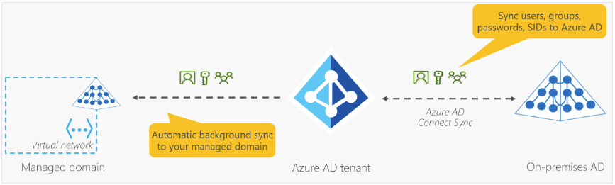

## Azure authentication methods

### Single sign-on

Single sign-on (SSO) enables a user to sign in one time and use that credential to access multiple resources and applications from different providers. For SSO to work, the different applications and providers must trust the initial authenticator.

More identities mean more passwords to remember and change. Password policies can vary among applications. As complexity requirements increase, it becomes increasingly difficult for users to remember them. The more passwords a user has to manage, the greater the risk of a credential-related security incident.

With SSO, you need to remember only one ID and one password. Access across applications is granted to a single identity that's tied to the user, which simplifies the security model. As users change roles or leave an organization, access is tied to a single identity. This change greatly reduces the effort needed to change or disable accounts. Using SSO for accounts makes it easier for users to manage their identities and for IT to manage users.

### Multifactor Authentication

Multifactor authentication is the process of prompting a user for an extra form (or factor) of identification during the sign-in process. MFA helps protect against a password compromise in situations where the password was compromised but the second factor wasn't.

Multifactor authentication provides additional security for your identities by requiring two or more elements to fully authenticate. These elements fall into three categories:

- Something the user knows – this might be a challenge question.
- Something the user has – this might be a code that's sent to the user's mobile phone.
- Something the user is – this is typically some sort of biometric property, such as a fingerprint or face scan.

Multifactor authentication increases identity security by limiting the impact of credential exposure (for example, stolen usernames and passwords). With multifactor authentication enabled, an attacker who has a user's password would also need to have possession of their phone or their fingerprint to fully authenticate.

Compare multifactor authentication with single-factor authentication. Under single-factor authentication, an attacker would need only a username and password to authenticate. Multifactor authentication should be enabled wherever possible because it adds enormous benefits to security.

Azure AD Multi-Factor Authentication is a Microsoft service that provides multifactor authentication capabilities. Azure AD Multi-Factor Authentication enables users to choose an additional form of authentication during sign-in, such as a phone call or mobile app notification.

### Passwordless authentication

Features like MFA are a great way to secure your organization, but users often get frustrated with the additional security layer on top of having to remember their passwords. People are more likely to comply when it's easy and convenient to do so. Passwordless authentication methods are more convenient because the password is removed and replaced with something you have, plus something you are, or something you know.

Passwordless authentication needs to be set up on a device before it can work. For example, your computer is something you have. Once it’s been registered or enrolled, Azure now knows that it’s associated with you. Now that the computer is known, once you provide something you know or are (such as a PIN or fingerprint), you can be authenticated without using a password.

Each organization has different needs when it comes to authentication. Microsoft global Azure and Azure Government offer the following three passwordless authentication options that integrate with Azure Active Directory (Azure AD):

- Windows Hello for Business
- Microsoft Authenticator app
- FIDO2 security keys

### Azure external identities

An external identity is a person, device, service, etc. that is outside your organization. Azure AD External Identities refers to all the ways you can securely interact with users outside of your organization. If you want to collaborate with partners, distributors, suppliers, or vendors, you can share your resources and define how your internal users can access external organizations. If you're a developer creating consumer-facing apps, you can manage your customers' identity experiences.

>The following capabilities make up External Identities:

- Business to business (B2B) collaboration - Collaborate with external users by letting them use their preferred identity to sign-in to your Microsoft applications or other enterprise applications (SaaS apps, custom-developed apps, etc.). B2B collaboration users are represented in your directory, typically as guest users.
- B2B direct connect - Establish a mutual, two-way trust with another Azure AD organization for seamless collaboration. B2B direct connect currently supports Teams shared channels, enabling external users to access your resources from within their home instances of Teams. B2B direct connect users aren't represented in your directory, but they're visible from within the Teams shared channel and can be monitored in Teams admin center reports.
- Azure AD business to customer (B2C) - Publish modern SaaS apps or custom-developed apps (excluding Microsoft apps) to consumers and customers, while using Azure AD B2C for identity and access management.

### Azure conditional access

Conditional Access is a tool that Azure Active Directory uses to allow (or deny) access to resources based on identity signals. These signals include who the user is, where the user is, and what device the user is requesting access from.

Conditional Access also provides a more granular multifactor authentication experience for users. For example, a user might not be challenged for second authentication factor if they're at a known location. However, they might be challenged for a second authentication factor if their sign-in signals are unusual or they're at an unexpected location.

During sign-in, Conditional Access collects signals from the user, makes decisions based on those signals, and then enforces that decision by allowing or denying the access request or challenging for a multifactor authentication response.

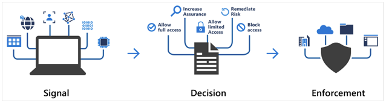

> Conditional Access is useful when you need to:

- Require multifactor authentication (MFA) to access an application depending on the requester’s role, location, or network. For example, you could require MFA for administrators but not regular users or for people connecting from outside your corporate network.
- Require access to services only through approved client applications. For example, you could limit which email applications are able to connect to your email service.
- Require users to access your application only from managed devices. A managed device is a device that meets your standards for security and compliance.
- Block access from untrusted sources, such as access from unknown or unexpected locations.

### Azure role-based access control

When you have multiple IT and engineering teams, how can you control what access they have to the resources in your cloud environment? The principle of least privilege says you should only grant access up to the level needed to complete a task. If you only need read access to a storage blob, then you should only be granted read access to that storage blob. Write access to that blob shouldn’t be granted, nor should read access to other storage blobs. It’s a good security practice to follow.

However, managing that level of permissions for an entire team would become tedious. Instead of defining the detailed access requirements for each individual, and then updating access requirements when new resources are created or new people join the team, Azure enables you to control access through Azure role-based access control (Azure RBAC).

### Role-based access control applied to resources

Role-based access control is applied to a scope, which is a resource or set of resources that this access applies to.

The following diagram shows the relationship between roles and scopes. A management group, subscription, or resource admin might be given the role of owner, so they have increased control and authority. An observer, who isn't expected to make any updates, might be given a role of Reader for the same scope, enabling them to review or observe the management group, subscription, or resource group.

Azure RBAC is hierarchical, in that when you grant access at a parent scope, those permissions are inherited by all child scopes. For example:

- When you assign the Owner role to a user at the management group scope, that user can manage everything in all subscriptions within the management group.
- When you assign the Reader role to a group at the subscription scope, the members of that group can view every resource group and resource within the subscription.

Azure RBAC is enforced on any action that's initiated against an Azure resource that passes through Azure Resource Manager. Resource Manager is a management service that provides a way to organize and secure your cloud resources.

You typically access Resource Manager from the Azure portal, Azure Cloud Shell, Azure PowerShell, and the Azure CLI. Azure RBAC doesn't enforce access permissions at the application or data level. Application security must be handled by your application.

Azure RBAC uses an allow model. When you're assigned a role, Azure RBAC allows you to perform actions within the scope of that role. If one role assignment grants you read permissions to a resource group and a different role assignment grants you write permissions to the same resource group, you have both read and write permissions on that resource group.

### Zero trust model

Zero Trust is a security model that assumes the worst case scenario and protects resources with that expectation. Zero Trust assumes breach at the outset, and then verifies each request as though it originated from an uncontrolled network.

Microsoft highly recommends the Zero Trust security model, which is based on these guiding principles:

- Verify explicitly - Always authenticate and authorize based on all available data points.
- Use least privilege access - Limit user access with Just-In-Time and Just-Enough-Access (JIT/JEA), risk-based adaptive policies, and data protection.
- Assume breach - Minimize blast radius and segment access. Verify end-to-end encryption. Use analytics to get visibility, drive threat detection, and improve defenses.

Traditionally, corporate networks were restricted, protected, and generally assumed safe. Only managed computers could join the network, VPN access was tightly controlled, and personal devices were frequently restricted or blocked.

The Zero Trust model flips that scenario. Instead of assuming that a device is safe because it’s within the corporate network, it requires everyone to authenticate. Then grants access based on authentication rather than location.

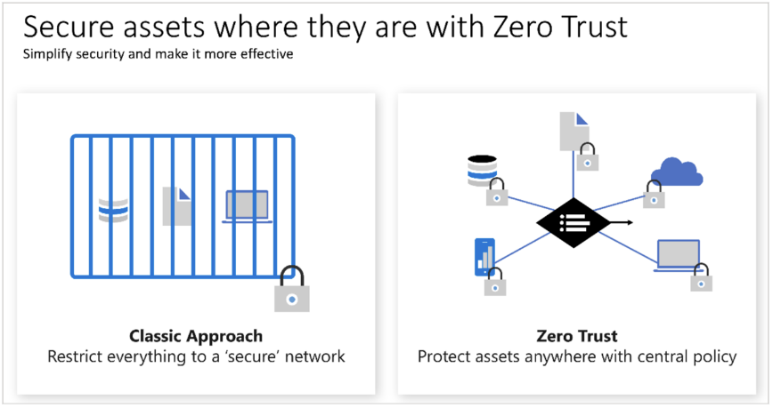

### Defense-in-depth

The objective of defense-in-depth is to protect information and prevent it from being stolen by those who aren't authorized to access it. A defense-in-depth strategy uses a series of mechanisms to slow the advance of an attack that aims at acquiring unauthorized access to data.

### Layers of defense-in-depth

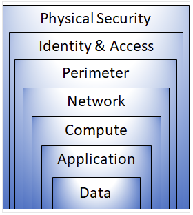

Each layer provides protection so that if one layer is breached, a subsequent layer is already in place to prevent further exposure. This approach removes reliance on any single layer of protection. It slows down an attack and provides alert information that security teams can act upon, either automatically or manually.

> Here's a brief overview of the role of each layer:

- The physical security layer is the first line of defense to protect computing hardware in the datacenter.
- The identity and access layer controls access to infrastructure and change control. (Control access to infrastructure and change control. Use single sign-on (SSO) and multifactor authentication. Audit events and changes.)
- The perimeter layer uses distributed denial of service (DDoS) protection to filter large-scale attacks before they can cause a denial of service for users. (Use DDoS protection to filter large-scale attacks before they can affect the availability of a system for users. Use perimeter firewalls to identify and alert on malicious attacks against your network.)
- The network layer limits communication between resources through segmentation and access controls. (Limit communication between resources. Deny by default.
Restrict inbound internet access and limit outbound access where appropriate. Implement secure connectivity to on-premises networks.)
- The compute layer secures access to virtual machines. (Secure access to virtual machines. Implement endpoint protection on devices and keep systems patched and current.)
- The application layer helps ensure that applications are secure and free of security vulnerabilities. (Ensure that applications are secure and free of vulnerabilities. Store sensitive application secrets in a secure storage medium. Make security a design requirement for all application development.)
- The data layer controls access to business and customer data that you need to protect. (Stored in a database.
Stored on disk inside virtual machines. Stored in software as a service (SaaS) applications, such as Office 365. Managed through cloud storage.)

These layers provide a guideline for you to help make security configuration decisions in all of the layers of your applications.

### Microsoft Defender for Cloud

Defender for Cloud is a monitoring tool for security posture management and threat protection. It monitors your cloud, on-premises, hybrid, and multi-cloud environments to provide guidance and notifications aimed at strengthening your security posture.

Defender for Cloud provides the tools needed to harden your resources, track your security posture, protect against cyber attacks, and streamline security management. Deployment of Defender for Cloud is easy, it’s already natively integrated to Azure.

### Protection everywhere you’re deployed
Because Defender for Cloud is an Azure-native service, many Azure services are monitored and protected without needing any deployment. However, if you also have an on-premises datacenter or are also operating in another cloud environment, monitoring of Azure services may not give you a complete picture of your security situation.

When necessary, Defender for Cloud can automatically deploy a Log Analytics agent to gather security-related data. For Azure machines, deployment is handled directly. For hybrid and multi-cloud environments, Microsoft Defender plans are extended to non Azure machines with the help of Azure Arc. Cloud security posture management (CSPM) features are extended to multi-cloud machines without the need for any agents.

> Defender for Cloud helps you detect threats across:

- Azure PaaS services – Detect threats targeting Azure services including Azure App Service, Azure SQL, Azure Storage Account, and more data services. You can also perform anomaly detection on your Azure activity logs using the native integration with Microsoft Defender for Cloud Apps (formerly known as Microsoft Cloud App Security).
- Azure data services – Defender for Cloud includes capabilities that help you automatically classify your data in Azure SQL. You can also get assessments for potential vulnerabilities across Azure SQL and Storage services, and recommendations for how to mitigate them.
- Networks – Defender for Cloud helps you limit exposure to brute force attacks. By reducing access to virtual machine ports, using the just-in-time VM access, you can harden your network by preventing unnecessary access. You can set secure access policies on selected ports, for only authorized users, allowed source IP address ranges or IP addresses, and for a limited amount of time.

### Defend your hybrid resources

In addition to defending your Azure environment, you can add Defender for Cloud capabilities to your hybrid cloud environment to protect your non-Azure servers. To help you focus on what matters the most, you'll get customized threat intelligence and prioritized alerts according to your specific environment.

To extend protection to on-premises machines, deploy Azure Arc and enable Defender for Cloud's enhanced security features.

### Defend resources running on other clouds
Defender for Cloud can also protect resources in other clouds (such as AWS and GCP).

For example, if you've connected an Amazon Web Services (AWS) account to an Azure subscription, you can enable any of these protections:

- Defender for Cloud's CSPM features extend to your AWS resources. This agentless plan assesses your AWS resources according to AWS-specific security recommendations, and includes the results in the secure score. The resources will also be assessed for compliance with built-in standards specific to AWS (AWS CIS, AWS PCI DSS, and AWS Foundational Security Best Practices). Defender for Cloud's asset inventory page is a multi-cloud enabled feature helping you manage your AWS resources alongside your Azure resources.
- Microsoft Defender for Kubernetes extends its container threat detection and advanced defenses to your Amazon EKS Linux clusters.
- Microsoft Defender for servers brings threat detection and advanced defenses to your Windows and Linux EC2 instances.

### Assess, Secure, and Defend
Defender for Cloud fills three vital needs as you manage the security of your resources and workloads in the cloud and on-premises:

- Continuously assess – Know your security posture. Identify and track vulnerabilities.
- Secure – Harden resources and services with Azure Security Benchmark.
- Defend – Detect and resolve threats to resources, workloads, and services.

#### Continuously assess

Defender for cloud helps you continuously assess your environment. Defender for Cloud includes vulnerability assessment solutions for your virtual machines, container registries, and SQL servers.

Microsoft Defender for servers includes automatic, native integration with Microsoft Defender for Endpoint. With this integration enabled, you'll have access to the vulnerability findings from Microsoft threat and vulnerability management.

#### Secure

From authentication methods to access control to the concept of Zero Trust, security in the cloud is an essential basic that must be done right. In order to be secure in the cloud, you have to ensure your workloads are secure. To secure your workloads, you need security policies in place that are tailored to your environment and situation. Because policies in Defender for Cloud are built on top of Azure Policy controls, you're getting the full range and flexibility of a world-class policy solution. In Defender for Cloud, you can set your policies to run on management groups, across subscriptions, and even for a whole tenant.

To help you understand how important each recommendation is to your overall security posture, Defender for Cloud groups the recommendations into security controls and adds a secure score value to each control. The secure score gives you an at-a-glance indicator of the health of your security posture, while the controls give you a working list of things to consider to improve your security score and your overall security posture.

#### Defend

Defender for Cloud also helps you defend your environment by providing security alerts and advanced threat protection features.

When Defender for Cloud detects a threat in any area of your environment, it generates a security alert. Security alerts:

- Describe details of the affected resources
- Suggest remediation steps
- Provide, in some cases, an option to trigger a logic app in response

Defender for cloud provides advanced threat protection features for many of your deployed resources, including virtual machines, SQL databases, containers, web applications, and your network. Protections include securing the management ports of your VMs with just-in-time access, and adaptive application controls to create allowlists for what apps should and shouldn't run on your machines.

[Back to top ⬆️](#index)

# Azure Fundamentals: Describe Azure management and governance (30–35%)

Azure shifts development costs from the capital expense (CapEx) of building out and maintaining infrastructure and facilities to an operational expense (OpEx) of renting infrastructure as you need it, whether it’s compute, storage, networking, and so on.

A number of factors influence the cost of Azure resources. The type of resources, the settings for the resource, and the Azure region will all have an impact on how much a resource costs. When you provision an Azure resource, Azure creates metered instances for that resource. The meters track the resources' usage and generate a usage record that is used to calculate your bill.

## Pricing and Total Cost of Ownership calculators

The pricing calculator and the total cost of ownership (TCO) calculator are two calculators that help you understand potential Azure expenses. Both calculators are accessible from the internet, and both calculators allow you to build out a configuration. However, the two calculators have very different purposes.

### Pricing calculator

The pricing calculator is designed to give you an estimated cost for provisioning resources in Azure. You can get an estimate for individual resources, build out a solution, or use an example scenario to see an estimate of the Azure spend. The pricing calculator’s focus is on the cost of provisioned resources in Azure.

With the pricing calculator, you can estimate the cost of any provisioned resources, including compute, storage, and associated network costs. You can even account for different storage options like storage type, access tier, and redundancy.

- Products This is where you choose the Azure services that you want to include in your estimate. You'll likely spend most of your time here.
- Example scenarios Here you'll find several reference architectures, or common cloud-based solutions that you can use as a starting point.
- Saved estimates Here you'll find your previously saved estimates.
- FAQs Here you'll discover answers to frequently asked questions about the Pricing calculator.

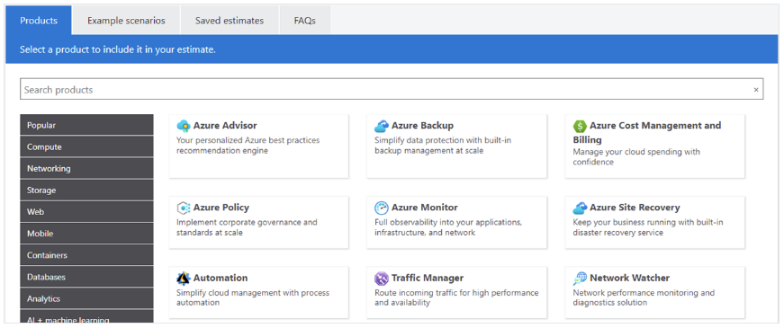

### TCO calculator

The TCO calculator is designed to help you compare the costs for running an on-premises infrastructure compared to an Azure Cloud infrastructure. With the TCO calculator, you enter your current infrastructure configuration, including servers, databases, storage, and outbound network traffic. The TCO calculator then compares the anticipated costs for your current environment with an Azure environment supporting the same infrastructure requirements.

With the TCO calculator, you enter your configuration, add in assumptions like power and IT labor costs, and are presented with an estimation of the cost difference to run the same environment in your current datacenter or in Azure.

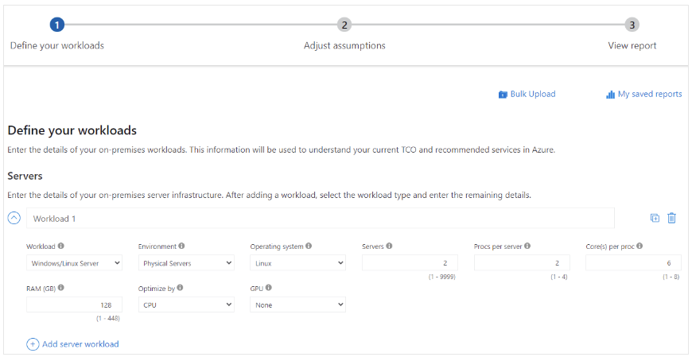

Recall that the TCO Calculator involves three steps:

## Azure Cost Management tool

Microsoft Azure is a global cloud provider, meaning you can provision resources anywhere in the world. You can provision resources rapidly to meet a sudden demand, or to test out a new feature, or on accident. If you accidentally provision new resources, you may not be aware of them until it’s time for your invoice. Cost Management is an Azure service that helps avoid those situations.

### Cost Management

Cost Management provides the ability to quickly check Azure resource costs, create alerts based on resource spend, and create budgets that can be used to automate management of resources.

Cost analysis is a subset of Cost Management that provides a quick visual for your Azure costs. Using cost analysis, you can quickly view the total cost in a variety of different ways, including by billing cycle, region, resource, and so on.

You use cost analysis to explore and analyze your organizational costs. You can view aggregated costs by organization to understand where costs are accrued and to identify spending trends. And you can see accumulated costs over time to estimate monthly, quarterly, or even yearly cost trends against a budget.

### Cost alerts

Cost alerts provide a single location to quickly check on all of the different alert types that may show up in the Cost Management service. The three types of alerts that may show up are:

- Budget alerts
- Credit alerts
- Department spending quota alerts

### Budgets

A budget is where you set a spending limit for Azure. You can set budgets based on a subscription, resource group, service type, or other criteria. When you set a budget, you will also set a budget alert. When the budget hits the budget alert level, it will trigger a budget alert that shows up in the cost alerts area. If configured, budget alerts will also send an email notification that a budget alert threshold has been triggered.

A more advanced use of budgets enables budget conditions to trigger automation that suspends or otherwise modifies resources once the trigger condition has occurred.

## Tags

As your cloud usage grows, it's increasingly important to stay organized. A good organization strategy helps you understand your cloud usage and can help you manage costs.

One way to organize related resources is to place them in their own subscriptions. You can also use resource groups to manage related resources. Resource tags are another way to organize resources. Tags provide extra information, or metadata, about your resources. This metadata is useful for:

- Resource management Tags enable you to locate and act on resources that are associated with specific workloads, environments, business units, and owners.
- Cost management and optimization Tags enable you to group resources so that you can report on costs, allocate internal cost centers, track budgets, and forecast estimated cost.
- Operations management Tags enable you to group resources according to how critical their availability is to your business. This grouping helps you formulate service-level agreements (SLAs). An SLA is an uptime or performance guarantee between you and your users.
- Security Tags enable you to classify data by its security level, such as public or confidential.
- Governance and regulatory compliance Tags enable you to identify resources that align with governance or regulatory compliance requirements, such as ISO 27001. Tags can also be part of your standards enforcement efforts. For example, you might require that all resources be tagged with an owner or department name.
- Workload optimization and automation Tags can help you visualize all of the resources that participate in complex deployments. For example, you might tag a resource with its associated workload or application name and use software such as Azure DevOps to perform automated tasks on those resources.

### Manage resource tags

You can add, modify, or delete resource tags through Windows PowerShell, the Azure CLI, Azure Resource Manager templates, the REST API, or the Azure portal.

You can use Azure Policy to enforce tagging rules and conventions. For example, you can require that certain tags be added to new resources as they're provisioned. You can also define rules that reapply tags that have been removed. Tags aren’t inherited, meaning that you can apply tags one level and not have those tags automatically show up at a different level, allowing you to create custom tagging schemas that change depending on the level (resource, resource group, subscription, and so on).

## Azure Blueprints

Azure Blueprints lets you standardize cloud subscription or environment deployments. Instead of having to configure features like Azure Policy for each new subscription, with Azure Blueprints you can define repeatable settings and policies that are applied as new subscriptions are created.
How many parameters does an Azure Blueprint Artifact need to be valid? 0

## Artifacts

Each component in the blueprint definition is known as an artifact.

It is possible for artifacts to have no additional parameters (configurations). An example is the Deploy threat detection on SQL servers policy, which requires no additional configuration. Artifacts can also contain one or more parameters that you can configure.

You can specify a parameter's value when you create the blueprint definition or when you assign the blueprint definition to a scope. In this way, you can maintain one standard blueprint but have the flexibility to specify the relevant configuration parameters at each scope where the definition is assigned.

Azure Blueprints deploy a new environment based on all of the requirements, settings, and configurations of the associated artifacts. Artifacts can include things such as:

- Role assignments
- Policy assignments
- Azure Resource Manager templates
- Resource groups

Azure Blueprints are version-able, allowing you to create an initial configuration and then make updates later on and assign a new version to the update. With versioning, you can make small updates and keep track of which deployments used which configuration set.

With Azure Blueprints, the relationship between the blueprint definition (what should be deployed) and the blueprint assignment (what was deployed) is preserved. In other words, Azure creates a record that associates a resource with the blueprint that defines it. This connection helps you track and audit your deployments.

## Azure Policy

Azure Policy is a service in Azure that enables you to create, assign, and manage policies that control or audit your resources. These policies enforce different rules across your resource configurations so that those configurations stay compliant with corporate standards.

Azure Policy enables you to define both individual policies and groups of related policies, known as initiatives. Azure Policy evaluates your resources and highlights resources that aren't compliant with the policies you've created. Azure Policy can also prevent noncompliant resources from being created.

Azure Policies can be set at each level, enabling you to set policies on a specific resource, resource group, subscription, and so on. Additionally, Azure Policies are inherited, so if you set a policy at a high level, it will automatically be applied to all of the groupings that fall within the parent. For example, if you set an Azure Policy on a resource group, all resources created within that resource group will automatically receive the same policy.

Azure Policy comes with built-in policy and initiative definitions for Storage, Networking, Compute, Security Center, and Monitoring. For example, if you define a policy that allows only a certain size for the virtual machines (VMs) to be used in your environment, that policy is invoked when you create a new VM and whenever you resize existing VMs. Azure Policy also evaluates and monitors all current VMs in your environment, including VMs that were created before the policy was created.

### Azure Policy initiatives

An Azure Policy initiative is a way of grouping related policies together. The initiative definition contains all of the policy definitions to help track your compliance state for a larger goal.

For example, Azure Policy includes an initiative named Enable Monitoring in Azure Security Center. Its goal is to monitor all available security recommendations for all Azure resource types in Azure Security Center.

Under this initiative, the following policy definitions are included:

- Monitor unencrypted SQL Database in Security Center This policy monitors for unencrypted SQL databases and servers.
- Monitor OS vulnerabilities in Security Center This policy monitors servers that don't satisfy the configured OS vulnerability baseline.
- Monitor missing Endpoint Protection in Security Center This policy monitors for servers that don't have an installed endpoint protection agent.
- In fact, the Enable Monitoring in Azure Security Center initiative contains over 100 separate policy definitions.

### Resource locks

A resource lock prevents resources from being accidentally deleted or changed.

Even with Azure role-based access control (Azure RBAC) policies in place, there's still a risk that people with the right level of access could delete critical cloud resources. Resource locks prevent resources from being deleted or updated, depending on the type of lock. Resource locks can be applied to individual resources, resource groups, or even an entire subscription. Resource locks are inherited, meaning that if you place a resource lock on a resource group, all of the resources within the resource group will also have the resource lock applied.

You can manage resource locks from the Azure portal, PowerShell, the Azure CLI, or from an Azure Resource Manager template.

To view, add, or delete locks in the Azure portal, go to the Settings section of any resource's Settings pane in the Azure portal.

Although locking helps prevent accidental changes, you can still make changes by following a two-step process.

To modify a locked resource, you must first remove the lock. After you remove the lock, you can apply any action you have permissions to perform. Resource locks apply regardless of RBAC permissions. Even if you're an owner of the resource, you must still remove the lock before you can perform the blocked activity.

## Service Trust portal

The Microsoft Service Trust Portal is a portal that provides access to various content, tools, and other resources about Microsoft security, privacy, and compliance practices.

The Service Trust Portal contains details about Microsoft's implementation of controls and processes that protect our cloud services and the customer data therein. To access some of the resources on the Service Trust Portal, you must sign in as an authenticated user with your Microsoft cloud services account (Azure Active Directory organization account). You'll need to review and accept the Microsoft non-disclosure agreement for compliance materials.

## Interacting with Azure

Azure provides multiple tools for managing your environment, including the:

- Azure portal
- Azure PowerShell
- Azure Command Line Interface (CLI)

### Azure PowerShell

Azure PowerShell is a shell with which developers, DevOps, and IT professionals can run commands called command-lets (cmdlets). These commands call the Azure REST API to perform management tasks in Azure. Cmdlets can be run independently to handle one-off changes, or they may be combined to help orchestrate complex actions such as:

- The routine setup, teardown, and maintenance of a single resource or multiple connected resources.
- The deployment of an entire infrastructure, which might contain dozens or hundreds of resources, from imperative code.

Capturing the commands in a script makes the process repeatable and automatable.

### Azure CLI

The Azure CLI is functionally equivalent to Azure PowerShell, with the primary difference being the syntax of commands. While Azure PowerShell uses PowerShell commands, the Azure CLI uses Bash commands.

The Azure CLI provides the same benefits of handling discrete tasks or orchestrating complex operations through code. It’s also installable on Windows, Linux, and Mac platforms, as well as through Azure Cloud Shell.

## Azure Arc

Managing hybrid and multi-cloud environments can rapidly get complicated. Azure provides a host of tools to provision, configure, and monitor Azure resources. What about the on-premises resources in a hybrid configuration or the cloud resources in a multi-cloud configuration?

In utilizing Azure Resource Manager (ARM), Arc lets you extend your Azure compliance and monitoring to your hybrid and multi-cloud configurations. Azure Arc simplifies governance and management by delivering a consistent multi-cloud and on-premises management platform.

Azure Arc provides a centralized, unified way to:

- Manage your entire environment together by projecting your existing non-Azure resources into ARM.
- Manage multi-cloud and hybrid virtual machines, Kubernetes clusters, and databases as if they are running in Azure.
- Use familiar Azure services and management capabilities, regardless of where they live.
- Continue using traditional ITOps while introducing DevOps practices to support new cloud and native patterns in your environment.
- Configure custom locations as an abstraction layer on top of Azure Arc-enabled Kubernetes clusters and cluster extensions.

## Azure Resource Manager and Azure ARM templates

Azure Resource Manager (ARM) is the deployment and management service for Azure. It provides a management layer that enables you to create, update, and delete resources in your Azure account. Anytime you do anything with your Azure resources, ARM is involved.

When a user sends a request from any of the Azure tools, APIs, or SDKs, ARM receives the request. ARM authenticates and authorizes the request. Then, ARM sends the request to the Azure service, which takes the requested action. You see consistent results and capabilities in all the different tools because all requests are handled through the same API.

> With Azure Resource Manager, you can:

- Manage your infrastructure through declarative templates rather than scripts. A Resource Manager template is a JSON file that defines what you want to deploy to Azure.
- Deploy, manage, and monitor all the resources for your solution as a group, rather than handling these resources individually.
- Re-deploy your solution throughout the development life-cycle and have confidence your resources are deployed in a consistent state.
- Define the dependencies between resources, so they're deployed in the correct order.
- Apply access control to all services because RBAC is natively integrated into the management platform.
- Apply tags to resources to logically organize all the resources in your subscription.
- Clarify your organization's billing by viewing costs for a group of resources that share the same tag.

### ARM templates

ARM templates are another example of infrastructure as code at work.

By using ARM templates, you can describe the resources you want to use in a declarative JSON format. With an ARM template, the deployment code is verified before any code is run. This ensures that the resources will be created and connected correctly. The template then orchestrates the creation of those resources in parallel. That is, if you need 50 instances of the same resource, all 50 instances are created at the same time.

Ultimately, the developer, DevOps professional, or IT professional needs only to define the desired state and configuration of each resource in the ARM template, and the template does the rest. Templates can even execute PowerShell and Bash scripts before or after the resource has been set up.

> ARM templates provide many benefits when planning for deploying Azure resources. Some of those benefits include:

- Declarative syntax: ARM templates allow you to create and deploy an entire Azure infrastructure declaratively. Declarative syntax means you declare what you want to deploy but don’t need to write the actual programming commands and sequence to deploy the resources.
- Repeatable results: Repeatedly deploy your infrastructure throughout the development lifecycle and have confidence your resources are deployed in a consistent manner. You can use the same ARM template to deploy multiple dev/test environments, knowing that all the environments are the same.
- Orchestration: You don't have to worry about the complexities of ordering operations. Azure Resource Manager orchestrates the deployment of interdependent resources, so they're created in the correct order. When possible, Azure Resource Manager deploys resources in parallel, so your deployments finish faster than serial deployments. You deploy the template through one command, rather than through multiple imperative commands.
- Modular files: You can break your templates into smaller, reusable components and link them together at deployment time. You can also nest one template inside another template. For example, you could create a template for a VM stack, and then nest that template inside of templates that deploy entire environments, and that VM stack will consistently be deployed in each of the environment templates.
- Extensibility: With deployment scripts, you can add PowerShell or Bash scripts to your templates. The deployment scripts extend your ability to set up resources during deployment. A script can be included in the template or stored in an external source and referenced in the template. Deployment scripts give you the ability to complete your end-to-end environment setup in a single ARM template.

## Azure Advisor

Azure Advisor evaluates your Azure resources and makes recommendations to help improve reliability, security, and performance, achieve operational excellence, and reduce costs. Azure Advisor is designed to help you save time on cloud optimization. The recommendation service includes suggested actions you can take right away, postpone, or dismiss.

The recommendations are divided into five categories:

- Reliability is used to ensure and improve the continuity of your business-critical applications.
- Security is used to detect threats and vulnerabilities that might lead to security breaches.
- Performance is used to improve the speed of your applications.
- Operational Excellence is used to help you achieve process and workflow efficiency, resource manageability, and deployment best practices.
- Cost is used to optimize and reduce your overall Azure spending.

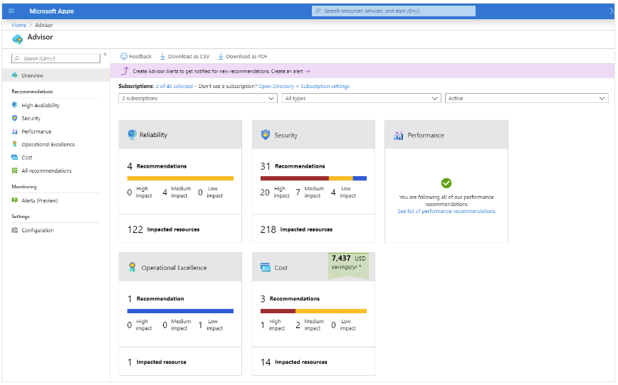

### Azure Service Health

Microsoft Azure provides a global cloud solution to help you manage your infrastructure needs, reach your customers, innovate, and adapt rapidly. Knowing the status of the global Azure infrastructure and your individual resources could seem like a daunting task. Azure Service Health helps you keep track of Azure resource, both your specifically deployed resources and the overall status of Azure. Azure service health does this by combining three different Azure services:

- Azure Status is a broad picture of the status of Azure globally. Azure status informs you of service outages in Azure on the Azure Status page. The page is a global view of the health of all Azure services across all Azure regions. It’s a good reference for incidents with widespread impact.
- Service Health provides a narrower view of Azure services and regions. It focuses on the Azure services and regions you're using. This is the best place to look for service impacting communications about outages, planned maintenance activities, and other health advisories because the authenticated Service Health experience knows which services and resources you currently use. You can even set up Service Health alerts to notify you when service issues, planned maintenance, or other changes may affect the Azure services and regions you use.
- Resource Health is a tailored view of your actual Azure resources. It provides information about the health of your individual cloud resources, such as a specific virtual machine instance. Using Azure Monitor, you can also configure alerts to notify you of availability changes to your cloud resources.

### Azure Monitor

Azure Monitor is a platform for collecting data on your resources, analyzing that data, visualizing the information, and even acting on the results. Azure Monitor can monitor Azure resources, your on-premises resources, and even multi-cloud resources like virtual machines hosted with a different cloud provider.

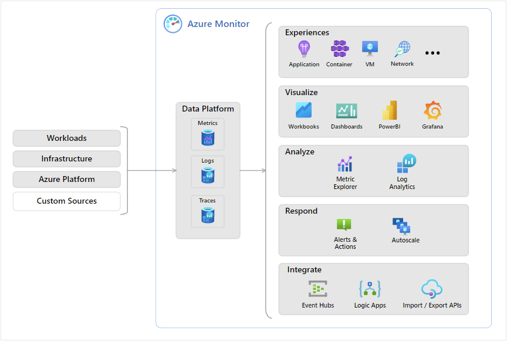

### Azure Log Analytics

Azure Log Analytics is the tool in the Azure portal where you’ll write and run log queries on the data gathered by Azure Monitor. Log Analytics is a robust tool that supports both simple, complex queries, and data analysis. You can write a simple query that returns a set of records and then use features of Log Analytics to sort, filter, and analyze the records. You can write an advanced query to perform statistical analysis and visualize the results in a chart to identify a particular trend. Whether you work with the results of your queries interactively or use them with other Azure Monitor features such as log query alerts or workbooks, Log Analytics is the tool that you're going to use to write and test those queries.

### Azure Monitor Alerts

Azure Monitor Alerts are an automated way to stay informed when Azure Monitor detects a threshold being crossed. You set the alert conditions, the notification actions, and then Azure Monitor Alerts notifies when an alert is triggered. Depending on your configuration, Azure Monitor Alerts can also attempt corrective action.

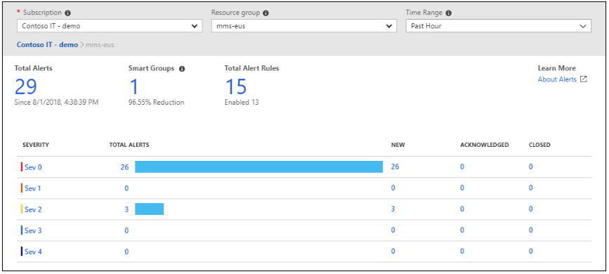

Alerts can be set up to monitor the logs and trigger on certain log events, or they can be set to monitor metrics and trigger when certain metrics are crossed. For example, you could set a metric-based alert up to notify you when the CPU usage on a virtual machine exceeded 80%. Alert rules based on metrics provide near real time alerts based on numeric values. Rules based on logs allow for complex logic across data from multiple sources.

### Application Insights

Application Insights, an Azure Monitor feature, monitors your web applications. Application Insights is capable of monitoring applications that are running in Azure, on-premises, or in a different cloud environment.

There are two ways to configure Application Insights to help monitor your application. You can either install an SDK in your application, or you can use the Application Insights agent. The Application Insights agent is supported in C#.NET, VB.NET, Java, JavaScript, Node.js, and Python.

Once Application Insights is up and running, you can use it to monitor a broad array of information, such as:

- Request rates, response times, and failure rates
- Dependency rates, response times, and failure rates, to show whether external services are slowing down performance
- Page views and load performance reported by users' browsers
- AJAX calls from web pages, including rates, response times, and failure rates
- User and session counts
- Performance counters from Windows or Linux server machines, such as CPU, memory, and network usage

Not only does Application Insights help you monitor the performance of your application, but you can also configure it to periodically send synthetic requests to your application, allowing you to check the status and monitor your application even during periods of low activity.

[Back to top ⬆️](#index)